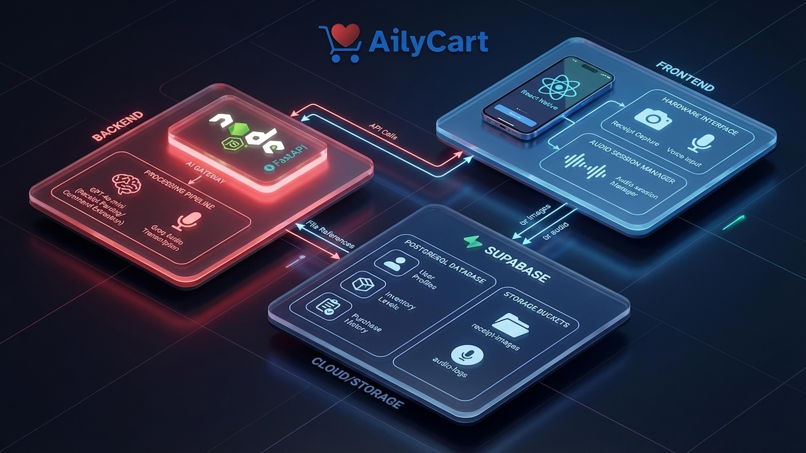

# AilyCart



**AilyCart** is an AI-powered smart shopping and inventory prediction mobile application. By integrating computer vision, voice processing, and Large Language Models (LLMs), AilyCart simplifies household inventory management through intelligent receipt scanning, voice-command logging, and predictive analytics.

---

## ✨ Key Features

* **📸 Smart Receipt Parsing**: Snap a photo of your shopping receipt, and the system automatically extracts item names, unit prices, and purchase dates.
* **🎙️ Voice Command Input**: Update your inventory hands-free using high-precision audio transcription powered by Groq.
* **🧠 AI-Driven Extraction**: Leverages GPT-4o-mini for complex entity recognition and intent parsing to ensure data accuracy.
* **📉 Inventory Prediction**: Intelligently predicts consumption patterns and suggests restocking schedules based on your purchase history.
* **☁️ Cloud Sync & Security**: Built on Supabase for real-time data synchronization, secure user authentication, and scalable cloud storage for media.

---

## 📱 Live Demo (Expo Go)

Experience **AilyCart** instantly by scanning the corresponding QR code for your device using the **Expo Go** app.

<div align="center">

| 📲 iOS & Android |
| :---: |
|  |
| *Scan with iOS Camera or Android Expo Go App* |

</div>

> **Prerequisite**: You must have the **Expo Go** app installed on your mobile device ([App Store](https://apps.apple.com/app/expo-go/id982107779) / [Play Store](https://play.google.com/store/apps/details?id=host.exp.exponent)).

> **Note**: As this is a pre-release version, some features (like receipt scanning) require the backend server to be active.

---

## 🛠️ Technical Architecture

AilyCart utilizes a modern full-stack architecture designed for performance and scalability:

### Frontend
* **Framework**: React Native (Expo)
* **Styling**: NativeWind (Tailwind CSS for React Native)
* **Core Modules**:
    * `Hardware Interface`: Custom camera for receipt capture and microphone integration.
    * `AVAudioSessionManager` & `Expo-Speech`: Manages audio routing and Text-to-Speech (TTS) feedback.

### Backend
* **Runtime**: Node.js / FastAPI
* **AI Processing Pipeline**:
    * **GPT-4o-mini**: Handles structured data extraction from raw OCR text.
    * **Groq Audio**: Provides ultra-low latency Speech-to-Text (STT) capabilities.
    * **LLM Command Extraction**: Parses natural language into actionable database commands.

### Infrastructure & Cloud
* **Backend-as-a-Service**: Supabase
* **Database**: PostgreSQL (User Profiles, Inventory Levels, Purchase History, etc.)
* **Object Storage**: Supabase Buckets (dedicated folders for `receipt-images` and `audio-logs`)

---

## 🚀 Getting Started

### Prerequisites
* Node.js (v18 or higher)
* Expo CLI
* Python 3.9+ (for FastAPI backend components)
* A Supabase project and relevant API keys

### Installation

1. **Clone the repository**
   ```bash
   git clone https://github.com/Yicong-Lin-213/AilyCart.git
   cd AilyCart
   ```

2. **Frontend Setup**
   ```bash
   cd frontend
   npm install
   npx expo start
   ```

3. **Backend Environment Variables**

   Create a `.env` file in the `backend` directory:
   ```env
   OPENAI_API_KEY=your_openai_key
   GROQ_API_KEY=your_groq_key
   SUPABASE_URL=your_supabase_url
   SUPABASE_ANON_KEY=your_supabase_key
   ```

## 📂 Project Structure

```text
├── frontend/             # React Native Expo mobile application
├── backend/              # Node.js and FastAPI server-side logic
├── docs/                 # Static assets and documentation images
├── database/             # Database schemas
├── README.md             # This file
└── LICNESE               # License file
```

---

## 📄 License

This project is licensed under the Apache License - see the [LICENSE](LICENSE) file for details.